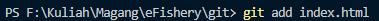

# Version Control Dengan Git

Latihan Version Control dengan Git melalui GitHub. Commnad yang dilakukan meluputi init, add, remote, commit, push, branch, pull, fetch, dan merge.

### Init
Inisiasi local folder menjadi git repo

### Add
Menambahkan satu file

Menambahkan semua file

Menambahkan folder

### Remote
Menambahkan url remote repoke local repo

### Commit
Melakukan commit atau snapshot pada local repo

### Push
Melakukan push file yang telah di commit ke remote repo

### Fetch
Mengecek perubahan aktivitas di remote repo 

### Pull
Menarik/mengambil perubahan pada remote repo ke local repo

### Branch
Membuat branch dengan nama landing page

### Merge
Melakukan merge dengan branch landing_page pada branch utama

### Status
Melakukan pengecekan aktivitas pada version control

### Log
Melakukan pengecekan log pada version control

## Author
Leonardo Dwigantoro