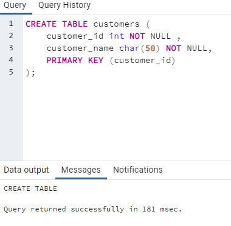
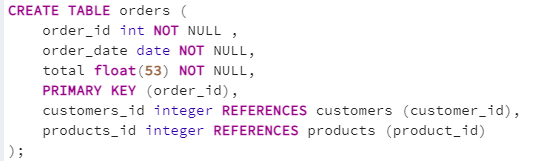
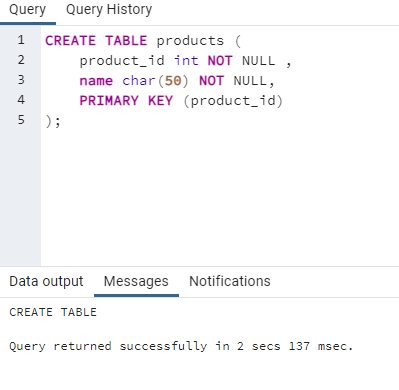
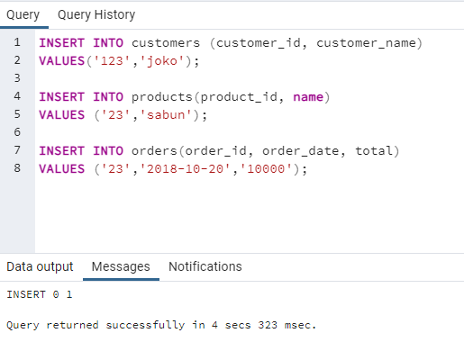
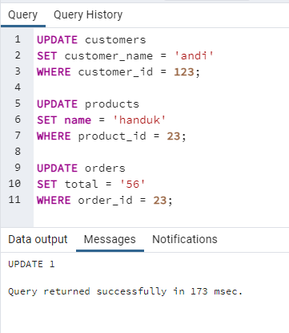
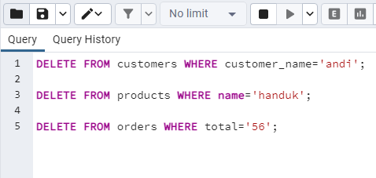
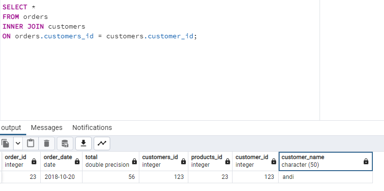
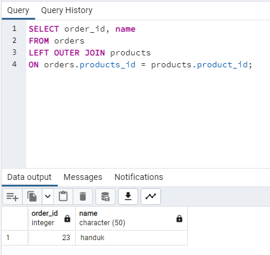

### Soal 1
Buatlah ERD halaman sebelumnya dengan menggunakan https://mermaid.live output berupa gambar dengan format png

### Soal 2
Buatlah query untuk membuat database pada halaman sebelumnya. Setelah itu buat query untuk create, insert, update, delete di masing-masing table. Bonus: Query join di table order ke customer dan product.

Create table

Insert

Update

Delete

Join

