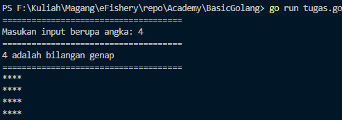
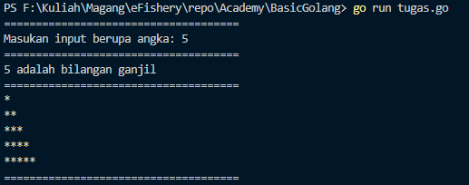

## The “Rect n Tri” 
 Buatlah sebuah fungsi dengan sebuah parameter angka. Jika angkanya ganjil maka program akan loop untuk print angka tersebut membentuk Triangle. Jika angka genap maka program akan loop membentuk Rectangle. Bonus kalau angkanya diinput di console

### Jika input merupakan bilangan genap 

### Jika input merupakan bilangan ganjil

