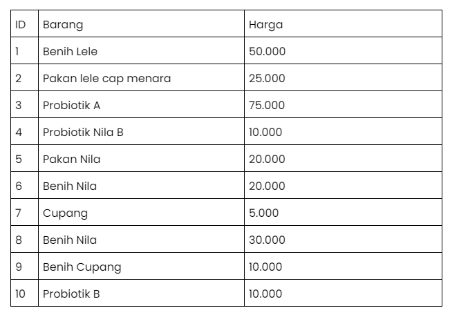
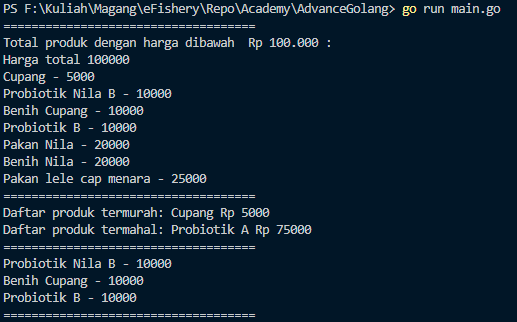

## Tugas Week 1 Soal 1
Petani memiliki uang 100.000 lalu barang yang ada di point eFishery sebagai berikut ini

a. Dengan data berikut ini buatlah sebuah algoritma agar petani dapat membeli barang paling banyak dengan jumlah uang 100.000. Petani hanya boleh membeli 1 item di masing-masing barang.

b. Buat function untuk mencari barang paling murah dan barang paling mahal. Tidak boleh menggunakan function sort.

c. Buatlah function untuk menampilkan barang dengan harga 10.000

## Contoh hasil Soal 1:
Total produk dengan harga dibawah  Rp 100.000 :

Harga total 100000

Cupang - 5000

Probiotik Nila B - 10000

Benih Cupang - 10000

Probiotik B - 10000

Benih Nila 1 - 20000

Pakan Nila - 20000

Pakan lele cap menara - 25000

------------------------------------------------
Daftar produk dengan harga Rp 10.000 :

Probiotik Nila B - 10000

Benih Cupang - 10000

Probiotik B - 10000

------------------------------------------------
Daftar produk termurah: Cupang Rp 5000

Daftar produk termahal: Probiotik A Rp 75000

## Output Program

