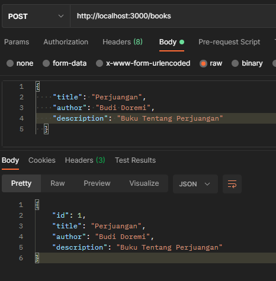
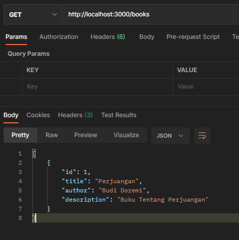
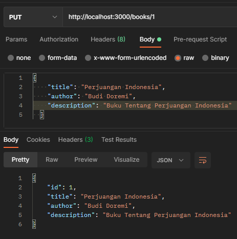
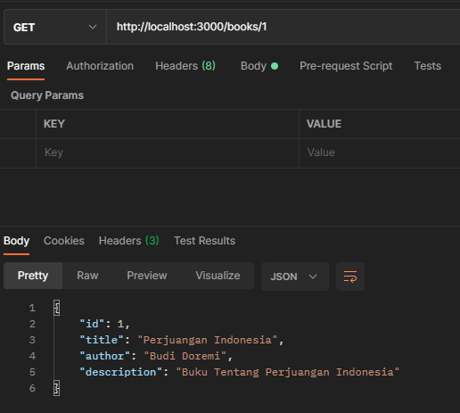
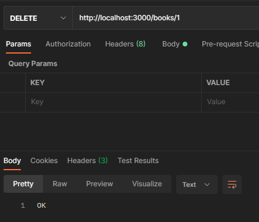

## Advance Golang pt.3
Buat satu aplikasi CRUD dengan golang menggunakan clean architecture yang terkoneksi dengan database. Hasil Program dibawah adalah hasil eksplorasi mandiri yang terdapat pada folder EksplorasiMandiri, untuk program yang dibuat dikelas dan menjadi tugas dapat dilihat di folder BelajarDiKantorDanTugas.

### Membuat Data Buku Baru

### Mendapatkan Daftar Semua Buku

### Update User

### Mendapatkan Daftar Buku Berdasarkan ID

### Menghapus Data Buku Berdasarkan ID
